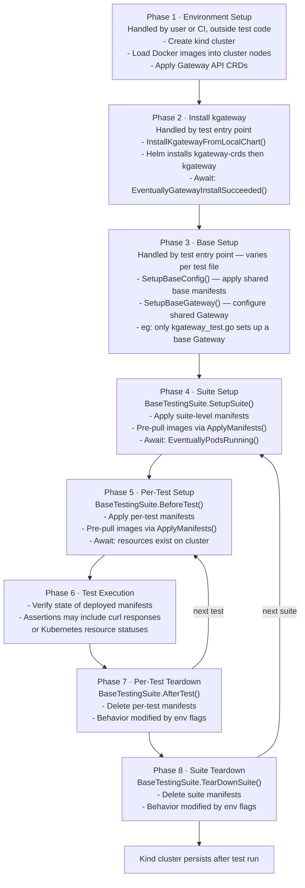

# kgateway E2E Testing Framework

This document describes the design and conventions of the kgateway end-to-end (E2E) test framework, located under [`test/e2e/`](../../test/e2e/).

> [!NOTE]
> For how to _run_ tests, see [`test/e2e/README-e2e-framework.md`](../../test/e2e/README-e2e-framework.md) and [`devel/testing/run-tests.md`](run-tests.md).
> For how to _write_ tests, see [`devel/testing/writing-tests.md`](writing-tests.md).

---

## Execution Flow Overview

The diagram below shows the full lifecycle of an E2E test run, from cluster setup through test execution and teardown. The inner loop iterates over individual tests within a suite; the outer loop iterates over suites.



---

## Cluster Setup

Tests run against a local [kind](https://kind.sigs.k8s.io/) cluster provisioned by the [`hack/kind/setup-kind.sh`](../../hack/kind/setup-kind.sh) script. This script:

1. Creates a kind cluster (defaulting to the name `kind`).
2. Loads locally-built Docker images into the cluster so tests don't require a registry.
3. Installs supporting infrastructure (e.g., MetalLB for `LoadBalancer` support via `setup-metalllb-on-kind.sh`).

The cluster name and kubeconfig context can be overridden at runtime:

| Environment Variable | Default | Description |
|---|---|---|
| `CLUSTER_NAME` | `kind` | Name of the kind cluster (used by `testruntime.NewContext()`) |
| `KUBE_CTX` | `kind-<CLUSTER_NAME>` | Kubernetes context to use (overrides the default when set) |

 The `testruntime.NewContext()` helper reads `CLUSTER_NAME` (defaulting it to `kind`), stores it as `runtimeContext.ClusterName`, and then `cluster.MustKindContext(runtimeContext.ClusterName)` in [`testutils/cluster/kind.go`](../../test/e2e/testutils/cluster/kind.go) uses that name and, if set, `KUBE_CTX` to build a `cluster.Context` that holds:

- `Name` – cluster name
- `KubeContext` – kubeconfig context string
- `RestConfig` – rest client configuration
- `Client` – `controller-runtime` client (registered with the Gateway scheme)
- `Clientset` – vanilla `kubernetes/client-go` clientset
- `Cli` – `kubectl` wrapper for shell-level operations
- `IstioClient` – Istio CLI client (used for manifest apply/delete)

---

## Installing kgateway

kgateway is installed via Helm from local charts at the start of each `*_test.go` entrypoint. Two charts are installed in order:

1. **CRD chart** (`kgateway-crds`) – installs all Custom Resource Definitions.
2. **Core chart** (`kgateway`) – installs the controller and supporting resources.

Both charts are driven by `install.Context`, which specifies:

```go
type Context struct {
    InstallNamespace          string   // e.g. "kgateway-test"
    ProfileValuesManifestFile string   // "production-like" Helm values (required)
    ValuesManifestFile        string   // test-specific Helm values (required)
    ExtraHelmArgs             []string // additional --set flags, etc.
}
```

 `TestInstallation.InstallKgatewayFromLocalChart()` performs the install and then calls `EventuallyGatewayInstallSucceeded()` to confirm the controller is healthy. The corresponding `UninstallKgateway()` call is registered with `t.Cleanup()` by the top-level `*_test.go` entrypoints via `testutils.Cleanup(...)` before invoking `InstallKgatewayFromLocalChart()`. Environment flags control whether that cleanup actually runs: `PERSIST_INSTALL` always skips uninstall; `FAIL_FAST_AND_PERSIST` skips uninstall only when the test fails (on success, cleanup still runs); and `SKIP_INSTALL` skips installation entirely, so no uninstall is registered.

---

## `TestInstallation`

[`TestInstallation`](../../test/e2e/test.go) is the central struct that every test suite receives. It bundles together all the information needed to interact with a single kgateway installation:

| Field | Type | Purpose |
|---|---|---|
| `RuntimeContext` | `testruntime.Context` | Runtime flags (cluster name, env vars) |
| `ClusterContext` | `*cluster.Context` | Kubernetes clients and cluster info |
| `Metadata` | `*install.Context` | Helm install parameters |
| `Actions` | `*actions.Provider` | Imperative operations (Helm, kubectl, curl) |
| `Assertions` | `*assertions.Provider` | Gomega-based assertion helpers |
| `AssertionsT` | `func(*testing.T) *assertions.Provider` | Per-test assertions (preferred) |
| `GeneratedFiles` | `GeneratedFiles` | Temp dir for generated files, failure dir for dumps |
| `IstioctlBinary` | `string` | Path to `istioctl` (set for Istio suites) |

The idiomatic way to create a `TestInstallation` is via `e2e.CreateTestInstallation()`:

```go
testInstallation := e2e.CreateTestInstallation(t, &install.Context{
    InstallNamespace:          installNs,
    ProfileValuesManifestFile: e2e.CommonRecommendationManifest,
    ValuesManifestFile:        e2e.EmptyValuesManifestPath,
})
```

There is typically one `TestInstallation` per `*_test.go` file. This makes it easy to see what configuration a group of tests runs against.

### Failure Dumps

If a test fails and `SKIP_BUG_REPORT` is not set, the framework calls `PerTestPreFailHandler()` to dump cluster state (pod logs, events, resource descriptions) to `GeneratedFiles.FailureDir`. In CI this directory is uploaded as a build artifact.

---

## The `SuiteRunner`

 [`suite.go`](../../test/e2e/suite.go) defines the `SuiteRunner` interface, which allows E2E tests to register suites in one place and execute them with `Run()`.

`NewSuiteRunner(ordered bool)` returns either an ordered or unordered implementation:

- **Ordered** (`orderedSuites`) – suites run in registration order. Used only when there is an explicit dependency between suites (e.g., upgrade tests). Must be justified with a comment.
- **Unordered** (`suites`) – suites run in map iteration order (not stable). Preferred for isolation.


## Feature Organization

All test suites live in the [`features/`](../../test/e2e/features/) directory, organized by feature area:

```
features/
├── basicrouting/
│   ├── suite.go          # TestingSuite struct + test methods
│   └── testdata/         # YAML manifests for this feature
├── cors/
├── jwt/
├── rate_limit/
│   ├── global/
│   └── local/
└── ...  (44 feature directories total)
```

The convention for a new feature is:

1. Create `features/my_feature/` directory.
2. Write YAML manifests to `features/my_feature/testdata/`.
3. Define Go type references (if needed) in `features/my_feature/types.go`.
4. Implement the suite in `features/my_feature/suite.go`.
5. Register the suite in the appropriate `tests/*_tests.go` file.

---

## `BaseTestingSuite`

[`tests/base/base_suite.go`](../../test/e2e/tests/base/base_suite.go) provides `BaseTestingSuite`, which most feature suites embed. It wires together the testify `suite.Suite` lifecycle with the kgateway manifest management approach.

### Struct fields

```go
type BaseTestingSuite struct {
    suite.Suite
    Ctx              context.Context
    TestInstallation *e2e.TestInstallation
    Setup            TestCase           // suite-level manifests
    TestCases        map[string]*TestCase // per-test manifests (keyed by method name)
    MinGwApiVersion  map[GwApiChannel]*GwApiVersion // suite-level Gateway API version guard
    // ... internal fields
}
```

### Suite Lifecycle

| Hook | What it does |
|---|---|
| `SetupSuite()` | Detects installed Gateway API version/channel, checks suite-level version requirements (`SkipSuite()`), selects the appropriate suite-level setup (for example via `setupByVersion`), and calls `ApplyManifests(selectedSetup)` to apply suite-level resources |
| `TearDownSuite()` | Calls `DeleteManifests(selectedSetup)` to remove the selected suite-level resources (skipped when `PERSIST_INSTALL` or `FAIL_FAST_AND_PERSIST`) |
| `BeforeTest(suiteName, testName)` | Looks up the `TestCase` for the current test method; checks per-test version requirements; calls `ApplyManifests(testCase)` |
| `AfterTest(suiteName, testName)` | On failure, invokes `PerTestPreFailHandler()` for a cluster state dump; calls `DeleteManifests(testCase)` to clean up per-test resources |

### Gateway API Version Guards

`BaseTestingSuite` detects the installed Gateway API version and channel (standard/experimental) by reading annotations on the `gateways.gateway.networking.k8s.io` CRD. Both suites and individual test cases can specify version constraints:

```go
testCases = map[string]*base.TestCase{
    "TestSessionPersistence": {
        Manifests: []string{sessionManifest},
        MinGwApiVersion: map[base.GwApiChannel]*base.GwApiVersion{
            base.GwApiChannelExperimental: &base.GwApiV1_1_0,
        },
    },
}
```

If requirements aren't met, the test (or entire suite) is skipped automatically.

---

## How Manifests Are Applied and Destroyed

Manifest lifecycle is managed by `ApplyManifests()` and `DeleteManifests()` on `BaseTestingSuite`, which delegate to the Istio client's `ApplyYAMLFiles` / `DeleteYAMLFiles` under the hood.

### `ApplyManifests(testCase *TestCase)`

1. **Pre-pull images** – Parses manifests to extract container images; creates temporary `image-puller` pods (5-minute timeout) to pre-pull each image before applying. This avoids flaky failures due to slow image pulls or registry rate-limiting.
2. **Apply manifests** – Calls `IstioClient.ApplyYAMLFiles("", manifests...)`. Supports an optional `ManifestsWithTransform` map for dynamic content substitution.
3. **Wait for static resources** – Parses manifest files into `client.Object` list and calls `EventuallyObjectsExist()` on them.
4. **Discover dynamic resources** – For each `Gateway` object not annotated as self-managed (`e2e.kgateway.dev/self-managed=true`), a proxy `Deployment` and `Service` are expected and added to a dynamic resource list. These are also awaited with `EventuallyObjectsExist()`.
5. **Wait for pods** – For all `Pod` and `Deployment` objects (static + dynamic), calls `EventuallyPodsRunning()` with a 60-second timeout.

### `DeleteManifests(testCase *TestCase)`

1. Strips `Namespace` resources from the manifests (deleting namespaces is slow and can interfere with other tests; namespaces are intentionally left for the lifetime of the cluster).
2. Writes the stripped manifest to a temp file in `GeneratedFiles.TempDir`.
3. Calls `IstioClient.DeleteYAMLFiles()` on the stripped manifests.

> [!NOTE]
> The framework deliberately avoids deleting Namespace objects during teardown. Pods and other resources within those namespaces are deleted, but the namespaces themselves persist for the lifetime of the cluster.

---

## Assertion Libraries

The framework uses two libraries for assertions:

| Library | Role |
|---|---|
| **Gomega** (`github.com/onsi/gomega`) | Retry-based assertions — keeps polling until a condition is true or times out. Used for anything async: waiting for pods, checking HTTP responses, verifying Kubernetes object state. |
| **Testify** (`github.com/stretchr/testify`) | Immediate assertions and suite lifecycle. Used in setup/teardown where there is no retry needed (e.g. `s.Require().NoError(err)`). Also drives `SetupSuite` / `TearDownSuite` / `BeforeTest` / `AfterTest`. |

> [!TIP]
> Simple rule: if you are **waiting for something to happen** on the cluster, use Gomega (`Eventually`). If something **must be true right now**, use Testify (`Require`).

### Key Methods on `assertions.Provider`

Access via `s.TestInstallation.AssertionsT(s.T())` inside a test method.

**HTTP / Curl**

| Method | When to use |
|---|---|
| `AssertEventualCurlResponse(...)` | Standard routing test — polls until response matches |
| `AssertEventuallyConsistentCurlResponse(...)` | Stability test — waits for match, then checks it stays consistent |
| `AssertEventualCurlError(...)` | Negative test — polls until curl fails with a specific exit code |

**Kubernetes Objects**

| Method | When to use |
|---|---|
| `EventuallyObjectsExist(ctx, objects...)` | After applying manifests — confirms objects were created |
| `EventuallyObjectsNotExist(ctx, objects...)` | After deleting — confirms objects are gone |
| `EventuallyPodsRunning(ctx, ns, listOpts)` | After apply — confirms pods are healthy |

**Gateway / Install**

| Method | When to use |
|---|---|
| `EventuallyGatewayAddress(ctx, name, ns)` | After Gateway creation — returns its IP/hostname |
| `EventuallyGatewayInstallSucceeded(ctx)` | After `helm install` — confirms controller is ready |

### Describing Expected HTTP Responses

Use `matchers.HttpResponse` to describe what you expect from a curl:

```go
&matchers.HttpResponse{
    StatusCode: http.StatusOK,
    Body:       gomega.ContainSubstring("expected text"),
}
```

Custom matchers live in [`test/gomega/matchers/`](../../test/gomega/matchers/).


---


## Common Test Resources

Default test "infrastructure" pods are defined in [`defaults/defaults.go`](../../test/e2e/defaults/defaults.go). These are reusable across all feature tests.

### Curl Pod

A minimal pod named `curl` in the `curl` namespace. Used as the origin for all in-cluster HTTP requests.

```go
CurlPodExecOpt = kubectl.PodExecOptions{
    Name:      "curl",
    Namespace: "curl",
    Container: "curl",
}
CurlPodManifest = ".../testdata/curl_pod.yaml"
```

The assertion helpers `AssertEventualCurlResponse` and related methods default to using `CurlPodExecOpt` as the source pod.

### httpbin

A standard HTTP echo/inspection service (`httpbin`) deployed in the `default` namespace. Commonly used as the backend service for routing tests.

```go
HttpbinDeployment = &appsv1.Deployment{Name: "httpbin", Namespace: "default"}
HttpbinService    = &corev1.Service{Name: "httpbin", Namespace: "default"}
HttpbinManifest   = ".../testdata/httpbin.yaml"
```

### http-echo

A lightweight HTTP echo pod (`http-echo` in the `http-echo` namespace) that returns request details. Useful for verifying header modifications, transformations, etc.

### nginx

An nginx pod in the `nginx` namespace. Used as a backend in basic routing and TLS tests. `NginxResponse` is the expected default nginx welcome page body.

### tcp-echo

A TCP echo pod in the `tcp-echo` namespace. Used for TCPRoute and TLS passthrough tests.

### ExtProc service

An external processing gRPC service for ExtProc tests (`ExtProcManifest`).

---

## Common Test Patterns

### Pattern 1: Apply → Curl → Assert (Most Common)

The dominant pattern is to define Kubernetes manifests for Gateway, HTTPRoute, and backend service, apply them in `BeforeTest`, send an HTTP request via the curl pod, and assert the response.

```go
// 1. Declare manifests and test cases
var (
    gatewayManifest = filepath.Join(fsutils.MustGetThisDir(), "testdata", "gateway.yaml")
    serviceManifest = filepath.Join(fsutils.MustGetThisDir(), "testdata", "service.yaml")

    setup = base.TestCase{Manifests: []string{gatewayManifest}}
    testCases = map[string]*base.TestCase{
        "TestMyFeature": {Manifests: []string{serviceManifest}},
    }
)

// 2. Implement the suite
type testingSuite struct{ *base.BaseTestingSuite }

func (s *testingSuite) TestMyFeature() {
    s.TestInstallation.AssertionsT(s.T()).AssertEventualCurlResponse(
        s.Ctx,
        defaults.CurlPodExecOpt,
        []curl.Option{
            curl.WithHost(kubeutils.ServiceFQDN(...)),
            curl.WithPort(80),
            curl.WithHostHeader("example.com"),
            curl.WithPath("/api"),
        },
        &matchers.HttpResponse{
            StatusCode: http.StatusOK,
            Body:       gomega.ContainSubstring("expected-body"),
        },
    )
}
```

`BaseTestingSuite.BeforeTest` / `AfterTest` automatically applies and removes the per-test manifests around each test method.

### Pattern 2: Suite-Level Shared Setup + Per-Test Variations

When multiple tests share the same Gateway and backend, define them in the suite-level `Setup`. Only the resource that differs per test (e.g., an HTTPRoute variant) goes in the per-test `TestCase`.

```go
setup = base.TestCase{
    Manifests: []string{gatewayManifest, backendManifest},
}
testCases = map[string]*base.TestCase{
    "TestHeaderMatch": {Manifests: []string{headerMatchRoute}},
    "TestPathMatch":   {Manifests: []string{pathMatchRoute}},
}
```

### Pattern 3: Consistent (Stable) Response Assertion

When verifying that a route is *not* flapping, use `AssertEventuallyConsistentCurlResponse`. It first waits for the response to match, then repeatedly asserts it continues to match:

```go
s.TestInstallation.AssertionsT(s.T()).AssertEventuallyConsistentCurlResponse(
    s.Ctx,
    defaults.CurlPodExecOpt,
    curlOpts,
    &matchers.HttpResponse{StatusCode: http.StatusOK},
    10*time.Second, // consistency window
    1*time.Second,  // polling interval
)
```

### Pattern 4: Negative / Error Assertion

To assert that a service is unreachable (e.g., after deleting a route):

```go
s.TestInstallation.AssertionsT(s.T()).AssertEventualCurlError(
    s.Ctx,
    defaults.CurlPodExecOpt,
    curlOpts,
    7, // curl exit code 7 = "Failed to connect"
)
```

### Pattern 5: Object Existence Assertion

Before or after applying/deleting manifests, assert Kubernetes API object state:

```go
assertions := s.TestInstallation.AssertionsT(s.T())
// Assert an object appears
assertions.EventuallyObjectsExist(ctx, &corev1.Pod{ObjectMeta: metav1.ObjectMeta{Name: "my-pod", Namespace: "default"}})

// Assert an object is cleaned up
assertions.EventuallyObjectsNotExist(ctx, mySecret)

// Assert nothing of a type exists (e.g., no stale HTTPRoutes)
assertions.EventuallyObjectTypesNotExist(ctx, &gwv1.HTTPRouteList{})
```

### Pattern 6: Multiple Installations (e.g., Istio)

Some test entry points configure a distinct `TestInstallation` with Istio installed. The `automtls_istio_test.go` entry point calls `testInstallation.AddIstioctl()` and `testInstallation.InstallMinimalIstio()` before running suites that verify mTLS behavior.

### Pattern 7: Gateway API Version-Gated Tests

When a feature depends on a specific Gateway API version or channel, declare `MinGwApiVersion` on the `TestCase` or suite:

```go
testCases = map[string]*base.TestCase{
    "TestXListenerSet": {
        Manifests: []string{listenerSetManifest},
        MinGwApiVersion: map[base.GwApiChannel]*base.GwApiVersion{
            base.GwApiChannelExperimental: &base.GwApiV1_3_0,
        },
    },
}
```

Tests not meeting the version requirement are automatically skipped with an informative message.

---

## Environment Variables Summary

| Variable | Effect |
|---|---|
| `PERSIST_INSTALL=true` | Skip install if already present; skip teardown |
| `FAIL_FAST_AND_PERSIST=true` | Skip install if present; skip teardown only on failure |
| `SKIP_INSTALL=true` | Skip install and teardown entirely |
| `SKIP_ALL_TEARDOWN=true` | Skip all teardown / cleanup (but still installs) |
| `SKIP_DUMP=true` | Disable failure state dumps |
| `SKIP_BUG_REPORT=true` | Disable failure state dumps |
| `ISTIO_VERSION` | Selects istioctl version for Istio test suites |
| `INSTALL_NAMESPACE` | Namespace to install kgateway into |
| `CLUSTER_NAME` | Kind cluster name |
| `KUBE_CTX` | Kubeconfig context override |

---

## Related Documents

- [`test/e2e/README-e2e-framework.md`](../../test/e2e/README-e2e-framework.md) – How to run tests, environment variables, manual steps
- [`test/e2e/debugging.md`](../../test/e2e/debugging.md) – Debugging E2E failures
- [`devel/testing/run-tests.md`](run-tests.md) – Running tests locally
- [`devel/testing/writing-tests.md`](writing-tests.md) – Writing new E2E tests
